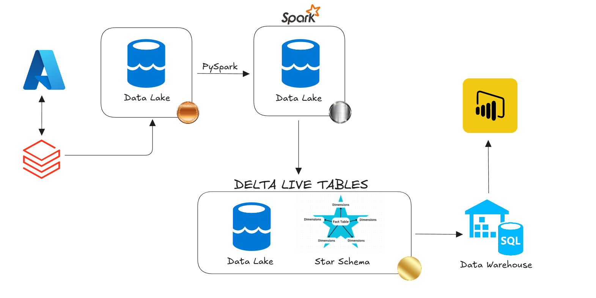
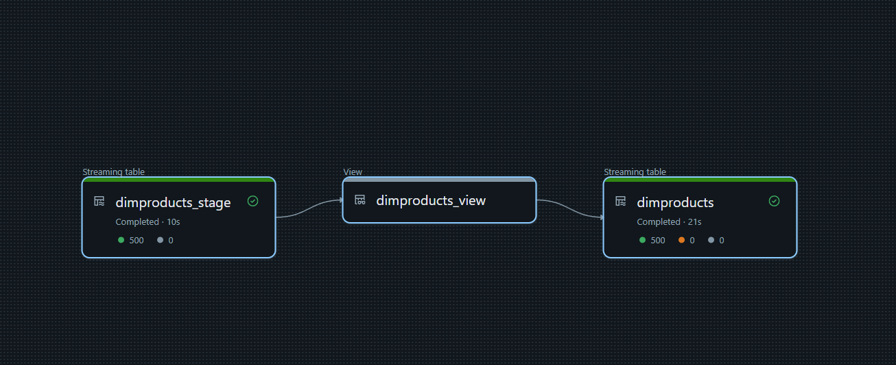
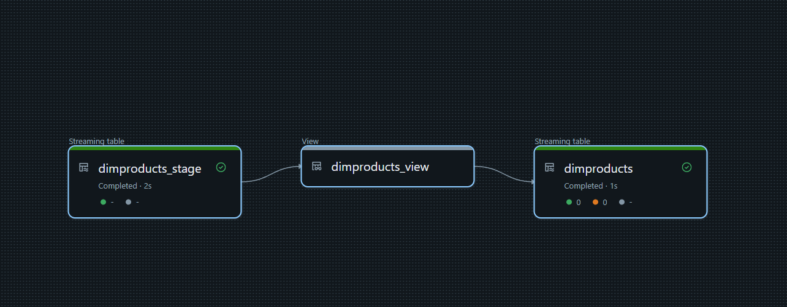
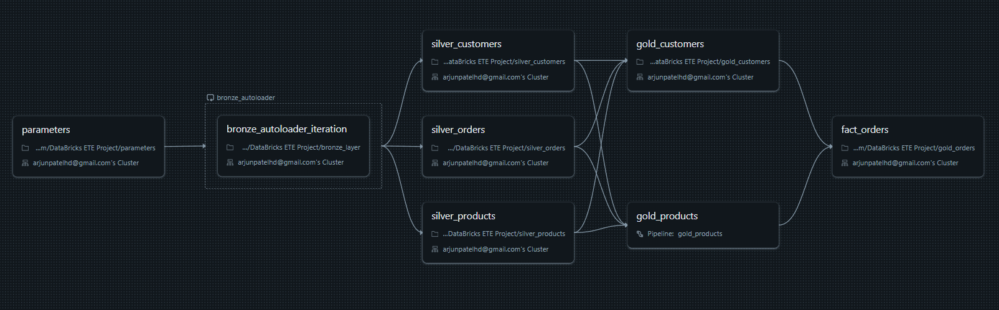

# Azure Databricks End-to-End Pipeline

This project demonstrates an end-to-end data pipeline built using **Azure Databricks**, **PySpark**, and **Delta Lake**. It includes data ingestion, transformation, and loading (ETL) processes that support both **batch** and **streaming** workloads. The architecture follows modern data engineering best practices, including a **Bronze-Silver-Gold tiered data structure**, **Delta Live Tables (DLT)** for incremental processing, and a **star schema** for optimized analytics.

---

## 📌 Project Overview

The goal of this project is to:

- Ingest raw data from a source (e.g., files, databases, streaming).
- Clean, transform, and enrich the data.
- Store structured and curated data in Delta Lake tables.
- Use Delta Live Tables for automated, reliable, and scalable transformations.
- Expose business-ready data for BI tools or downstream applications.

---

## 🧩 Key Features

| Feature | Description |
|--------|-------------|
| **Data Ingestion** | Uses Auto Loader for efficient batch and streaming ingestion into Delta Lake. |
| **Delta Live Tables (DLT)** | Automates transformation pipelines with idempotency and incremental load capabilities. |
| **Bronze-Silver-Gold Architecture** | Ensures proper separation of concerns during data transformation. |
| **Star Schema Design** | Optimized for querying and reporting in data warehouse environments. |
| **Scalable & Reliable** | Built on Azure Databricks and Delta Lake for performance and fault tolerance. |

---

## 🖼️ Architecture Diagram



*Overview of the Azure-based pipeline: Data Lake → Bronze → Silver → Gold → Reporting Layer*

---
## 🔄 DLT View





### Description :

- dimproducts_stage : Streaming table for raw product data.
- dimproducts_view : Intermediate view for data transformation.
- dimproducts : Final streaming table with transformed data.

*Demonstration of how DLT ensures consistent and incremental data updates.*

---
## 🔁 Pipeline View



### Description :

- Bronze Layer : Raw data ingestion using Auto Loader.
- Silver Layer : Cleaned and transformed data.
- Gold Layer : Final, business-ready data.
- Fact Orders : Joins customer and product data for analysis.

*Streaming and transformation flow using Delta Live Tables.*

---

## 🧾 Slowly Changing Dimension (SCD) Implementation

This section demonstrates how to implement Slowly Changing Dimensions (SCD) of Type 1 and Type 2 in the context of this Azure Databricks pipeline. These techniques are essential for maintaining historical data integrity in dimension tables within a data warehouse

### Implementation of SCD Type 1

``` python
# Load existing dimension table (old records)
if init_load_flag == 0:
    df_old = spark.sql('''
        SELECT dimCustomerKey, customer_id, create_date, update_date 
        FROM databricks_cata.gold.DimCustomers ''')
else:
    # Empty DataFrame for first load
    df_old = spark.sql('''
        SELECT 0 AS dimCustomerKey, 0 AS customer_id, 0 AS create_date, 0 AS update_date 
        FROM databricks_cata.silver.customers_silver WHERE 1 = 0 ''')

# Rename old columns to avoid conflict during join
df_old = df_old.withColumnRenamed("dimCustomerKey", "old_dimCustomerKey") \
               .withColumnRenamed("customer_id", "old_customer_id") \
               .withColumnRenamed("create_date", "old_create_date") \
               .withColumnRenamed("update_date", "old_update_date")

# Join new and old data to identify changes
df_join = df.join(df_old, df.customer_id == df_old.old_customer_id, "left")

# Split into new and old records
df_new = df_join.filter(col("old_dimCustomerKey").isNull())
df_old = df_join.filter(col("old_dimCustomerKey").isNotNull())

# Prepare old records: retain key, update timestamp
df_old = df_old.drop("old_customer_id", "old_update_date")
df_old = df_old.withColumnRenamed("old_dimCustomerKey", "dimCustomerKey")
df_old = df_old.withColumnRenamed("old_create_date", "create_date")
df_old = df_old.withColumn("create_date", to_timestamp(col("create_date")))
df_old = df_old.withColumn("update_date", current_timestamp())

# Prepare new records: add timestamps and surrogate key
df_new = df_new.drop("old_dimCustomerKey", "old_customer_id", "old_update_date", "old_create_date")
df_new = df_new.withColumn("update_date", current_timestamp()) \
               .withColumn("create_date", current_timestamp())

# Generate surrogate keys
df_new = df_new.withColumn("dimCustomerKey", monotonically_increasing_id() + lit(1))

# Add max surrogate key if not initial load
if init_load_flag == 0:
    df_maxsurr = spark.sql("SELECT MAX(dimCustomerKey) AS max_surrogate_key FROM databricks_cata.gold.DimCustomers")
    max_surrogate_key = df_maxsurr.collect()[0]["max_surrogate_key"]
    df_new = df_new.withColumn("dimCustomerKey", lit(max_surrogate_key) + col("dimCustomerKey"))
else:
    max_surrogate_key = 0

# Combine old and new records
df_final = df_new.unionByName(df_old)

# Write final result using Delta merge (SCD Type 1 logic)
if spark.catalog.tableExists("databricks_cata.gold.DimCustomers"):
    dlt_obj = DeltaTable.forPath(spark, "abfss://gold@azuredatabrickse2e.dfs.core.windows.net/DimCustomers")
    
    dlt_obj.alias("trg").merge(df_final.alias("src"), "trg.dimCustomerKey = src.dimCustomerKey") \
             .whenMatchedUpdateAll() \
             .whenNotMatchedInsertAll() \
             .execute()
else:
    df_final.write \
        .mode("overwrite") \
        .option("path", "abfss://gold@azuredatabrickse2e.dfs.core.windows.net/DimCustomers") \
        .saveAsTable("databricks_cata.gold.DimCustomers")
```

### Implementation of SCD Type 2 using DLT

``` python
# Define Expectations for Data Quality
my_rules = {
    "product_id_not_null": "product_id IS NOT NULL",
    "product_name_not_null": "product_name IS NOT NULL"
}

# Streaming Table: Raw Product Stage with Expectations

@dlt.table()
@dlt.expect_all_or_drop(my_rules)
def DimProducts_Stage():
    """
    Ingests raw product data from Silver layer with quality checks.
    """
    df = spark.readStream.table("databricks_cata.silver.products_silver")
    return df
    
# Streaming View: Intermediate view for transformation logic

@dlt.view()
def DimProducts_View():
    """
    Intermediate streaming view for further transformations (if needed).
    """
    df = spark.readStream.table("Live.DimProducts_Stage")
    return df

#️ Create Target Streaming Table for SCD Type 2
dlt.create_streaming_table("DimProducts")

# Apply Changes with SCD Type 2 Logic
dlt.apply_changes(
    target="DimProducts",
    source="DimProducts_View",
    keys=["product_id"],
    sequence_by="product_id",  # Optional: use timestamp if available
    stored_as_scd_type=2)
```


